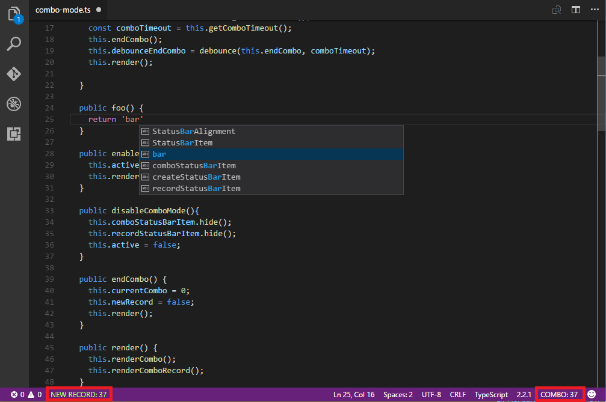
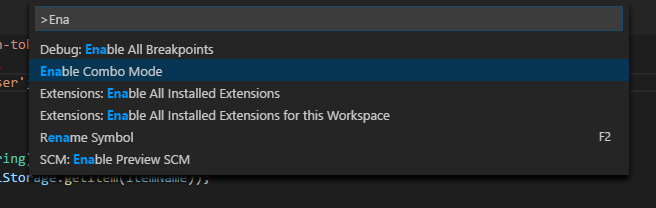

# VS Code - Combo Mode

This is a simple extension to add a counter of typed characters before a timeout in VS Code.

## Install

With the VS Code package manager:

`ext install combo-mode`

## Usage

Open the Command Pallete  <kbd>⇧</kbd>-<kbd>⌘</kbd>-<kbd>P<kbd> (Windows, Linux <kbd>Ctrl</kbd>-<kbd>Shift</kbd>-<kbd>P</kbd>) and enable the Combo Mode:

 

## Extension Settings

This extension contributes the following settings:

* `comboMode.comboTimeout`: Time (seconds) of combo duration (Default: 2).

## Release Notes

Read the [Release Notes](/CHANGELOG.md).